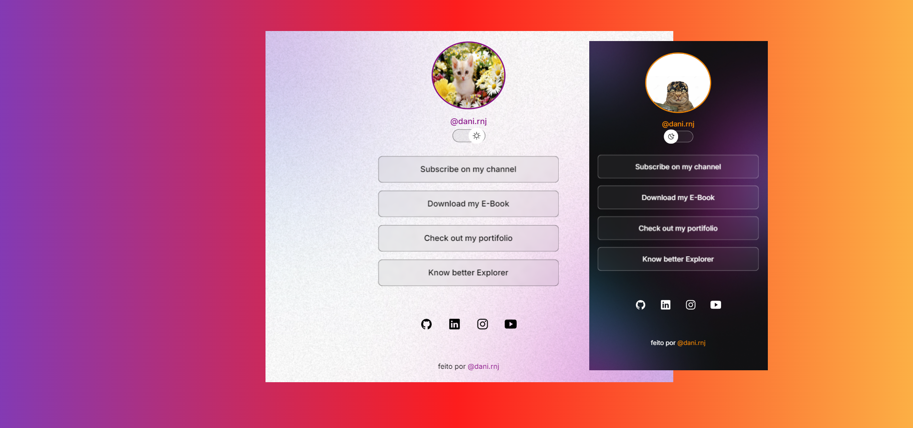

<h1 align="center">Poor LinkTree Clone</h1>

<a href="https://www.instagram.com/dani.rnj/" target="_blank">Did you liked? Click here and get in touch with me for more informations.  @dani.rnj</a>

  &nbsp;&nbsp;&nbsp;|&nbsp;&nbsp;&nbsp;<a href="#-layout">About the project</a>&nbsp;&nbsp;&nbsp;|&nbsp;&nbsp;&nbsp;

 

  

## 💻 Used Technologies

This project was developed with the following technologies:

-HTML
 
-CSS
 
-JS
 
-Git/GitHub
 
-Figma

## 🚀 Project Description

Customizable page that houses all your important links that you want to share with your viewers.

## 📋 Layout

You can see the project layout by clicking <a href="https://www.figma.com/community/file/1187422022288947321/devlinks-projeto-discover" target="_blank">here</a>.

## 🧾 License

  

